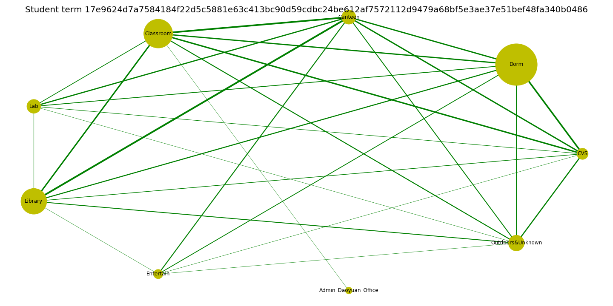
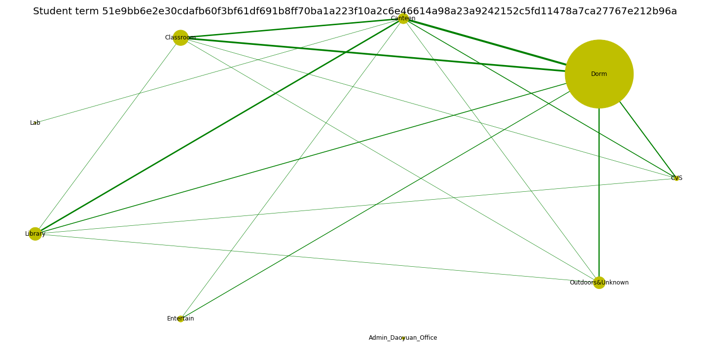

<br>

### Learning Analytics

The project uses the latest machine learning and big data methods, such as XGBOOST and tree-based models, to explore the learning data (desensitization) of the Chinese University of Hong Kong (Shenzhen), in order to help to build a smart campus.

Students' WiFi network log is collected and translated into meaningful behavior data (e.g. attendance, time in library and dorm, network packet delivery ratio, time entropy). State-of-the-art Machine learning methods, such as XGBoost, are used to predict students' GPA change in the semester, so as to alarm students showing sign of significant GPA falling. Also, decision tree algorithm is used to back-test the prediction model, allowing us to further optimize our dataset and model. The final model achieves overall accuracy 96.3% and sensitivity 81.8%.

This project is one of subprojects of __Smart School Project__ granted by Shenzhen Research Institute of Big Data (SRIBD). __Individualization (personalization)__ is common goal in industry 4.0, and we aim to make it come true in education.

<br>

### Trajectory Network Analysis

The project constructs and visualizes the individual trajectory networks of students at Chinese University of Hong Kong (Shenzhen) from raw WiFi log. This is a foundational project focusing on network modeling, visualization and descriptive analysis, so as to develop subprojects in education and social science, such as friendship discovery, depression discovery, etc.

The trajectory network matrices are computed from campus WiFi network log, with node size data (time spend on the place) on the diagonal and directed edge data (movement freqency between the places) on the others. Nodes (places) are organized and condensed into several major categories including residence, classroom building, library and activity. Additionally, network matrices are visualized using [NetworkX](https://networkx.github.io/) for further observation and pattern discovery.

```{r,out.width= "75%", fig.cap='Trajectory Network of A Sample Student (GPA = 4.00)', fig.align="center", echo=FALSE}
library(knitr)

```

```{r,out.width= "75%", fig.cap='Trajectory Network of A Sample Student (GPA = 1.58)', fig.align="center", echo=FALSE}
library(knitr)

```

Basic and advanced network metrics are used to describe the networks in a quantitative way, including centrality, transitivity, clustering coefficient, density, time entropy, and entropy on other network metrics.

This project is one of subprojects of __Smart School Project__ granted by Shenzhen Research Institute of Big Data (SRIBD).

<br>

### Mediation Analysis on Components of Frailty

Frailty is common clinical syndrome in older adults who are at increased risk for poor health outcomes. It can be categorized into five components, which are exhaustion, muscle weakness, slowness in walking, physical inactivity, and unintentional weight loss. Previous studies have reported a complex loop mechaism among those components, but none of them provides evidence of mediation between them. Therefore, this project is to provide the evidence of mediation relationship among those compoents of frailty using data from Rancho Bernrdo study.

Racho Bernado study is an observational cohort study includes multiple measurements regarding body composition, strength, and performance in older adults. The dataset consist of measures taken in visit 7 to 10 of the study and 1466 subjects who had at least one measures recorded during these visit time. All the variables are categorized into three levels.

The traditional Baron and Kenny's three-steps method based on proportional odds model is used to compute the direct and indirect effect of the frailty's components. Further, the Sobel's test is used to test whether the mediators' effect/indirect effect is significant.

The poster can be viewed [here](files/capstone_poster.pdf).

```{r,out.width= "100%", fig.cap='Poster of Mediation Relationship between Components of Frailty', fig.align="center", echo=FALSE}
library(knitr)
include_graphics("images/capstone_poster.jpg")
```

### Diagnosis of Heart Disease Using Generalized Linear Model

Cardiovascular disease are the top 1 cause of death in adults in the United States. This project explored the applicability of Generalized Linear Model (GLM) in cardiovascular disease diagnosis, either in term of the presence or the severity. The dataset used is the compiled version of _Heart Disease_ dataset in UCI Machine Learning Repository.

Three GLMs were used to diagnose heart disease, based on the paitients' age, sex, chest pain type, fasting blood pressure, and heart rate, etc. Logistic regression with backards selection was used to diagnose the presence of narrowing vessel, while Proportional Odds model and Partial Proportion Odds model were applied to predict on the severity of the heart disease. It was concluded that heart disease can be well-predicted by logistic regression and Partial Proportional Odds Model.

The poster can be viewed [here](files/Biostats_Final_Poster.pdf).

```{r,out.width= "100%", fig.cap='Poster of Heart Disease Diagnosis By GLM', fig.align="center", echo=FALSE}
library(knitr)
include_graphics("images/bio2_poster.jpg")
```

<br>

### Relationship Between Wage and Professions by Causal Inference Machine Learning

Causal inference is a new trend within machine learning used to help bussiness and policy decision makers better understand causes and impacts so they can make better decisions. This project aims to answer whether people's professions determine their wage, rather than a confounding phenomenon resulted from other factors such as race, education level and marital status.

The project supposes to find causal relationship using counterfactual outcome, and a roadmap for causal inference is followed. After building structural causal model and check the identifiability using back-door criterion, average treatment effect (ATE) is estimated by four methods - Simple Substitution Estimation, Inverse Probability Weighted Estimation (IPTW), Augmented Inverse Probability Weighted Estimation (AIPW), and Targted Maximum Likelihood Estimatn. Meanwhile, Super Leaner incorporating multiple machine learning algorithms (e.g., Lasso regression, random forest, xgboost, etc) is used to estimate conditional mean outcome and propensity score, which ensures multiple good property of above estimation (e.g, consistency, asymptotical normality, etc). This method inherits good predictivity of machine learning methods, and also enable to make inference like traditional statistical methods. 

This project finally concludes that people's wage will be higher if they are doing information-class job than that if they are doing industry-class job. The final report can be viewed [here](files/causal_final_report.html).

```{r,out.width= "100%",fig.align="center", echo=FALSE}
library(knitr)
include_graphics("images/causal_ate.png")
```

<br>

### Overview of Robust Regression Methods and Outlier Detection

Ordinary Least Square (OLS) Regression is hailed as the _Best Linear Unbiased Estimator (BLUE)_, under the assumption of linearity, normality, homoskedasticity, and being without outliers. However, data in real world usually fail to meet all the OLS assumptions. Further, OLS regression is volunerable to some violations of assumptions, especially when there is outlier in its predictors. Thus, alternatives to OLS is in need.

This project provides an overview of multiple robust estimation methods for regression, e.g. M-estimation, bounded-influence regression and MM-estimation, etc. We dive into the theoretical depth behind this methods, and evaluate them in term of finite breakdown point and relative efficiency. And also, an application with data simulated for multiple extreme situations (e.g., heavy-tailed error, outliers in predictors and response variables, etc) is provided.

The project report can be viewed [here](files/Robust_Regression.pdf).

<br>

### An Interactive Web Apps For A Beef Company's Sales Data

This project is to make an interactive Web App for the client [Happy Valley Meat (HVG) Company](https://shop.happyvalleymeat.com/?fbclid=IwAR05ImjSw7cvdcuDSgnD_b_Ku5nxVAIyJ1HZuOtF2oO_CrGgORNQl4s4LtQ), using R `Shiny` package. This apps is supposed to provide relevant information in an interactive and understandable way, so as to assist customers to choose right products when making a purchase. the customers of HVM can input the weight and cuts of meat that they are interested in when making a purchase.

The Web App I developed has four sections - __Beef Cut__, __Transaction__, __Nutrition__, and __About__. The __Beef Cut__ section is to display the environmental impact made by each beef cut per unit, so as to show that beef cut with less total weight per cattle generate greater pollutions in term of water usage, CO2 emission, and land use. The __Transaction__ section includes data of customers’ eating choices in restaurants and steakhouses at Year 2018, indicating that multiple beef cuts that required larger number of cattles slaughtered are preferred by customers. The __Nutrition__ section indicates that those environmentally friendly beef cuts (for example, ground beef) include equal or even higher nutritive value than the others. The __About__ section gives brief introduction of the HVM company and the data sources.

The Web App can be visied [here](https://kaizhangcornell.shinyapps.io/data_science_mid_project/).

```{r,out.width= "100%", fig.cap='A Screenshot of the Web App', fig.align="center", echo=FALSE}
library(knitr)
include_graphics("images/ShinyApp.png")
```