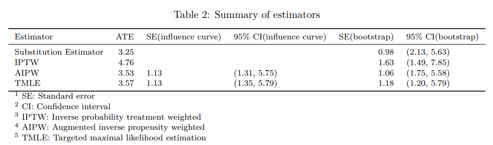
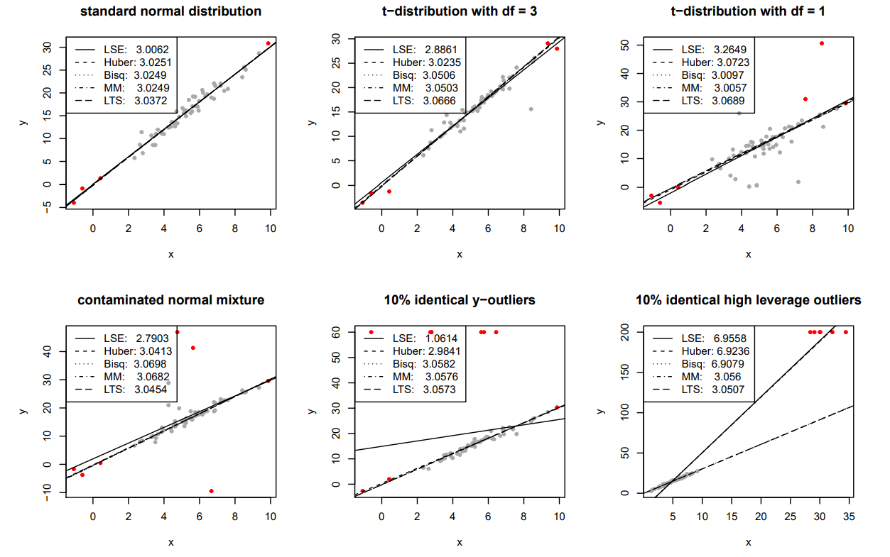

<br>

### Learning Analytics

The project uses the latest machine learning and big data methods, such as XGBOOST and tree-based models, to explore the learning data (desensitization) of the Chinese University of Hong Kong (Shenzhen), in order to help to build a smart campus.

Students' WiFi network log is collected and translated into meaningful behavior data (e.g. attendance, time in library and dorm, network packet delivery ratio, time entropy). State-of-the-art Machine learning methods, such as XGBoost, are used to predict students' GPA change in the semester, so as to alarm students showing sign of significant GPA falling. Also, decision tree algorithm is used to back-test the prediction model, allowing us to further optimize our dataset and model. The final model achieves overall accuracy 96.3% and sensitivity 81.8%.

This project is one of subprojects of __Smart School Project__ granted by Shenzhen Research Institute of Big Data (SRIBD). __Individualization (personalization)__ is common goal in industry 4.0, and we aim to make it come true in education.

```{r,out.width= "75%", fig.cap='Trajectory Network of A Sample Student (GPA = 4.00)', fig.align="center", echo=FALSE}
library(knitr)

```

<br>

### Trajectory Network Analysis

The project constructs and visualizes the individual trajectory networks of students at Chinese University of Hong Kong (Shenzhen) from raw WiFi log. This is a foundational project focusing on network modeling, visualization and descriptive analysis, so as to develop subprojects in education and social science, such as friendship discovery, depression discovery, etc.

The trajectory network matrices are computed from campus WiFi network log, with node size data (time spend on the place) on the diagonal and directed edge data (movement freqency between the places) on the others. Nodes (places) are organized and condensed into several major categories including residence, classroom building, library and activity. Additionally, network matrices are visualized using [NetworkX](https://networkx.github.io/) for further observation and pattern discovery.

```{r,out.width= "75%", fig.cap='Trajectory Network of A Sample Student (GPA = 4.00)', fig.align="center", echo=FALSE}
library(knitr)
include_graphics("images/network1.png")
```

```{r,out.width= "75%", fig.cap='Trajectory Network of A Sample Student (GPA = 1.58)', fig.align="center", echo=FALSE}
library(knitr)
include_graphics("images/network2.png")
```

Basic and advanced network metrics are used to describe the networks in a quantitative way, including centrality, transitivity, clustering coefficient, density, time entropy, and entropy on other network metrics.

This project is one of subprojects of __Smart School Project__ granted by Shenzhen Research Institute of Big Data (SRIBD).

<br>

### Mediation Analysis on Components of Frailty

Frailty is common clinical syndrome in older adults who are at increased risk for poor health outcomes. It can be categorized into five components, which are exhaustion, muscle weakness, slowness in walking, physical inactivity, and unintentional weight loss. Previous studies have reported a complex loop mechaism among those components, but none of them provides evidence of mediation between them. Therefore, this project is to provide the evidence of mediation relationship among those compoents of frailty using data from Rancho Bernrdo study.

Racho Bernado study is an observational cohort study includes multiple measurements regarding body composition, strength, and performance in older adults. The dataset consist of measures taken in visit 7 to 10 of the study and 1466 subjects who had at least one measures recorded during these visit time. All the variables are categorized into three levels.

The traditional Baron and Kenny's three-steps method based on proportional odds model is used to compute the direct and indirect effect of the frailty's components. Further, the Sobel's test is used to test whether the mediators' effect/indirect effect is significant.

The poster can be viewed [here](files/capstone_poster.pdf).

```{r,out.width= "100%", fig.cap='Poster of Mediation Relationship between Components of Frailty', fig.align="center", echo=FALSE}
library(knitr)
include_graphics("images/capstone_poster.jpg")
```

<br>

### Relationship Between Wage and Professions by Causal Inference Machine Learning

Causal inference is a new trend within machine learning used to help bussiness and policy decision makers better understand causes and impacts so they can make better decisions. This project aims to answer whether people's professions determine their wage, rather than a confounding phenomenon resulted from other factors such as race, education level and marital status.

The project supposes to find causal relationship using counterfactual outcome, and a roadmap for causal inference is followed. After building structural causal model and check the identifiability using back-door criterion, average treatment effect (ATE) is estimated by four methods - Simple Substitution Estimation, Inverse Probability Weighted Estimation (IPTW), Augmented Inverse Probability Weighted Estimation (AIPW), and Targted Maximum Likelihood Estimatn. Meanwhile, Super Leaner incorporating multiple machine learning algorithms (e.g., Lasso regression, random forest, xgboost, etc) is used to estimate conditional mean outcome and propensity score, which ensures multiple good property of above estimation (e.g, consistency, asymptotical normality, etc). This method inherits good predictivity of machine learning methods, and also enable to make inference like traditional statistical methods. 

This project finally concludes that people's wage will be higher if they are doing information-class job than that if they are doing industry-class job. The final report can be viewed [here](files/causal_final_report.pdf).

```{r,out.width= "100%",fig.align="center", echo=FALSE}
library(knitr)

```

<br>

### Prediction of Intubation Need of COVID+ Inpaitients

This project aims to predict the need of intubation for COVID positive inpatients in New York Presbyterian hospital, using machine learning and deep learning techniques.

The features were extracted from patients baseline profiles and longitudinal data of vital sign test.

The project report can be viewed [here](files/covid_project_report.pdf).

```{r,out.width= "100%",fig.align="center", echo=FALSE, fig.cap= 'Perfromace evaluation of model on test data'}
library(knitr)
include_graphics("images/covid_prediction.png")
```

<br>

### Overview of Robust Regression Methods and Outlier Detection

Ordinary Least Square (OLS) Regression is hailed as the _Best Linear Unbiased Estimator (BLUE)_, under the assumption of linearity, normality, homoskedasticity, and being without outliers. However, data in real world usually fail to meet all the OLS assumptions. Further, OLS regression is volunerable to some violations of assumptions, especially when there is outlier in its predictors. Thus, alternatives to OLS is in need.

This project provides an overview of multiple robust estimation methods for regression, e.g. M-estimation, bounded-influence regression and MM-estimation, etc. We dive into the theoretical depth behind this methods, and evaluate them in term of finite breakdown point and relative efficiency. And also, an application with data simulated for multiple extreme situations (e.g., heavy-tailed error, outliers in predictors and response variables, etc) is provided.

The project report can be viewed [here](files/Robust_Regression.pdf).

```{r,out.width= "100%",fig.align="center", echo=FALSE, fig.cap= 'Perfromace evaluation of robust regression on simulated data (true beta = 3)'}
library(knitr)

```